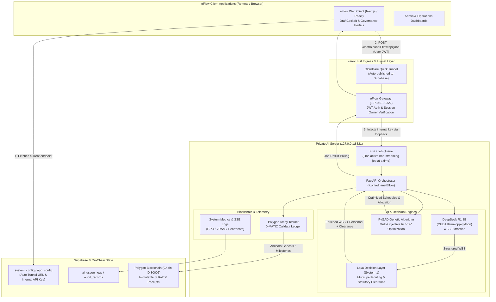

# eFlow Server Side

A premium, high-performance React dashboard for managing, monitoring, and controlling local Large Language Models (LLMs).

## 🚀 Overview

This system serves as a centralized command center for your local AI backend. It runs models directly using a built-in Python backend powered by `llama-cpp-python` with CUDA GPU acceleration.

> **eFlow deployment boundary:** port `8321` is a private loopback service. Remote eFlow traffic must enter through eFlow's JWT-protected gateway on port `8322`; never point Cloudflare directly at this model API. The local control dashboard may still use the internal API key, but that key must never be returned to the deployed eFlow browser.

eFlow requests use the server-owned `/controlpanelEflow/api/jobs` FIFO queue. The node executes one non-streaming DeepSeek job at a time, exposes owner-scoped status polling through the gateway, and automatically begins the next waiting request when the active request finishes.

`server/start.py` supervises the private AI process and the Cloudflare Quick Tunnel publisher. It starts an embedded JWT-protected AI gateway on `127.0.0.1:8322` when a full eFlow gateway is not already running on that host. The publisher tunnels only that gateway, writes every new Quick Tunnel URL directly to Supabase `system_config`, and restarts the tunnel automatically after a failure. No administrator copies or enters the URL.

The tunnel and gateway remain available for eFlow Admin/control operations while the local model process restarts. Only AI-backed actions are gated by `ai_endpoint_status`; a DeepSeek outage does not disable normal eFlow task, project, user-management, or reporting workflows.

### Key Features

- **🧠 Local Model Backend**: The server downloads and runs registered GGUF models directly through `llama-cpp-python` with CUDA acceleration.
- **🏛️ Laya Decision Layer**: System-1 bounded governance engine for municipal routing (IT, GSO, CPDO, LEDIPO, BPLO, Budget, HRMO), statutory BAC / cash-advance clearance, urgency classification, and personnel skill matching.
- **🧬 PyGAD Process Optimization**: Multi-objective genetic algorithm solving RCPSP (Resource-Constrained Project Scheduling), workload leveling, and knapsack budget allocation across municipal proposals.
- **⛓️ Polygon Blockchain Audit Ledger**: Calldata-only immutable anchoring on Polygon Amoy (Chain ID 80002) providing tamper-proof SHA-256 genesis, milestone, and clearance receipts.
- **🎛️ LLM Activation Panel**: Instantly enable, disable, or hot-swap models using intuitive UI toggles.
- **📊 Live Operations Dashboard**: Monitor actual GPU utilization, VRAM allocation, GPU temperature, power draw, CPU/RAM use, process memory, uptime, and model workload.
- **🔑 Private Internal Authentication**: The model key is loaded server-side from Supabase `app_config`, used only by the local dashboard and eFlow gateway, and never returned to the deployed browser.
- **🚦 Shared FIFO Queue**: One DeepSeek job runs at a time while additional users receive queue positions instead of model-busy errors.
- **☁️ Automatic Quick Tunnel Publishing**: Rotating Cloudflare URLs, runtime status, messages, and heartbeats are written directly to Supabase.
- **🌐 Dashboard Tunnel Control**: View, copy, and intentionally rotate the active Quick Tunnel; the supervisor publishes the replacement to Supabase automatically.
- **♻️ Clean AI Restart**: `npm run restart` removes stale AI API, dashboard, queue, supervisor, and matching tunnel processes before starting one clean stack.
- **📝 Live Server Logs**: Real-time terminal-style server logging via SSE (Server-Sent Events) for instant debugging and monitoring.
- **🎨 eFlow Operations UI**: A light, governance-focused console aligned with the main eFlow visual language, plus a focused dark live-log surface.

---

## 🔌 API Guide: How to Use the Models

The local backend acts as an API server on port `8321`. It is fully compatible with standard chat completion formats (like Ollama). All API endpoints are grouped under the `/controlpanelEflow` prefix to ensure secure routing.

### 1. Authentication
Every direct loopback request to the private backend requires the internal API key in the `Authorization` header. The server loads this key from the Supabase `app_config` row whose key is `llm_auth_key`; the local dashboard can manage it through the backend. Remote eFlow browsers never receive this key and use a verified Supabase user JWT at the gateway instead.

```http
Authorization: Bearer <YOUR_API_KEY>
```

### 2. Base Endpoint
If you are querying the backend directly from another application:
```text
http://127.0.0.1:8321/controlpanelEflow
```

### 3. Generate a Chat Completion (`/api/chat`)
This is the primary endpoint to interact with the active models. Only models that are toggled to "ON" in the Control Dashboard can be queried. 

**POST** `http://127.0.0.1:8321/controlpanelEflow/api/chat`

**Request Body (JSON):**
```json
{
  "model": "llama3:8b",
  "messages": [
    { "role": "system", "content": "You are a helpful coding assistant." },
    { "role": "user", "content": "Write a python script to reverse a string." }
  ],
  "stream": true 
}
```

> **Note on `stream`**: By default, streaming is enabled. Responses will be returned as newline-delimited JSON (`application/x-ndjson`) chunk by chunk. Set `"stream": false` if you want a single, complete response object at the end.

**Example using `curl`:**
```bash
curl -X POST http://127.0.0.1:8321/controlpanelEflow/api/chat \
  -H "Authorization: Bearer YOUR_API_KEY" \
  -H "Content-Type: application/json" \
  -d '{
    "model": "deepseek-r1:8b",
    "messages": [{"role": "user", "content": "What is 2+2?"}],
    "stream": false
  }'
```

**eFlow integration boundary**

The deployed eFlow browser must not call port `8321`, `/AUTHKEY`, or `/api/authkey`. It discovers eFlow's rotating gateway endpoint from Supabase, sends the signed-in user's Supabase access token to `POST /controlpanelEflow/api/ai/jobs`, and polls the owner-scoped job resource. The gateway validates that session and adds the internal model key only while proxying over loopback to this server.

### 4. Fetch Available Models (`/api/tags`)
Get a list of all models registered and available for download/use.

**GET** `http://127.0.0.1:8321/controlpanelEflow/api/tags`
*Response contains an array of model objects including their download status and VRAM size requirements.*

### 5. Check Running Models (`/api/ps`)
See which model is currently loaded into VRAM. Note: The system unloads and hot-swaps models automatically depending on the incoming requests.

**GET** `http://127.0.0.1:8321/controlpanelEflow/api/ps`

### 6. Read Operations Telemetry (`/api/operations`)

Returns live GPU, VRAM, temperature, power, system memory/CPU, private-process, model, and FIFO queue telemetry for the local dashboard.

### 7. Read or Rotate the Published Tunnel

- **GET** `/controlpanelEflow/api/tunnel/status` reads the endpoint and heartbeat currently stored in Supabase `system_config`.
- **POST** `/controlpanelEflow/api/tunnel/rotate` asks the separate tunnel supervisor for a fresh Quick Tunnel. The replacement URL is published automatically; callers never paste or overwrite `ai_endpoint` themselves.

### 8. Laya Decision Layer: Proposal Decomposition (`/api/chat`)

The server automatically intercepts proposal decomposition prompts originating from eFlow's `DraftCockpit` (identified by section title, team roster, and budget parameters). 

**Processing Pipeline**:
1. DeepSeek R1 8B extracts pure Work Breakdown Structure (WBS) tasks, subtasks, and skill tags.
2. The pipeline pipes R1's structured output into the **Laya Decision Layer** (`server/laya_service.py`).
3. Laya applies System-1 bounded governance heuristics to inject:
   - **Municipal Routing**: Assigns target office (`IT`, `LEDIPO`, `CPDO`, `BPLO`, `GSO/Procurement`, `Budget/Accounting`, or `HRMO`).
   - **Governance & Statutory Clearance**: Detects statutory mandates (`BAC Resolution`, `Petty Cash / Cash Advance`, or standard execution).
   - **Priority & Urgency**: Classifies `High`, `Med`, or `Low` with confidence scores based on deadlines, critical-path status, and budget scale.
   - **Personnel Recommendation**: Computes skill-overlap vectors against available municipal staff and suggests optimal employee assignment.
   - **Compliance Audit Reasoning**: Generates an audit trail rationale justifying the routing and clearance.
4. Returns the exact JSON structure expected by eFlow's frontend without requiring client-side translation.

### 9. PyGAD Process Optimization (`/api/optimization/optimize-proposal`)

Executes multi-objective Genetic Algorithm optimization over proposal tasks and employee rosters.

**POST** `http://127.0.0.1:8321/controlpanelEflow/api/optimization/optimize-proposal`

**Request Body (JSON):**
```json
{
  "tasks": [
    {
      "title": "Configure Fiber Backbone & Core Switches",
      "estimatedDuration": "3 weeks",
      "requiredSkills": ["Networking", "Infrastructure"],
      "budgetLines": [{"amount": 250000, "category": "Capital Outlay"}]
    }
  ],
  "employees": [
    {
      "id": "emp-01",
      "name": "Engr. Santos",
      "skills": ["Networking", "Systems Admin"],
      "workload": 2
    }
  ],
  "profile": "balanced",
  "num_generations": 40
}
```

**Optimization Profiles**:
- `balanced`: Harmonizes skill suitability (35%), workload variance (25%), risk (20%), and schedule (15%).
- `fast_track`: Minimizes makespan and prioritizes parallel critical-path execution (schedule 45%, skill 30%).
- `low_risk`: Heavily penalizes employee weaknesses and burnout thresholds (risk 35%, workload 30%, skill 25%).

### 10. Polygon Blockchain Governance Ledger (`/api/blockchain/*`)

Anchors municipal lifecycle events onto the Polygon Amoy Testnet (Chain ID `80002`) using 0-MATIC calldata transactions.

- **POST** `/controlpanelEflow/api/blockchain/anchor-proposal` — Computes canonical SHA-256 hash of proposal data and anchors the genesis record on-chain. Returns `tx_hash`, `block_number`, and `explorer_url`.
- **POST** `/controlpanelEflow/api/blockchain/anchor-event` — Anchors governance milestone clearances (e.g. `bac_clearance`, `cash_advance_release`, `milestone_approval`).
- **GET** `/controlpanelEflow/api/blockchain/verify/{doc_hash}?tx_hash=0x...` — Verifies on-chain calldata integrity against the recomputed document hash.
- **GET** `/controlpanelEflow/api/blockchain/certificate/{proposal_id}` — Generates a verifiable chain-of-custody audit certificate with chronological block timestamps.

---

## 📋 Requirements

- **Python 3.10+** — [Download Python](https://www.python.org/downloads/)
- **Node.js 18+** — [Download Node.js](https://nodejs.org/)
- **cloudflared** — required for automatic remote eFlow Quick Tunnels
- **8 GB+ RAM** — 16 GB recommended for larger models
- **NVIDIA GPU** — See GPU & CUDA section below before installing

### Included Models (auto-downloaded on first use)

| Model | Size | Purpose |
|-------|------|---------|
| Llama 3 8B | ~4.7 GB | General chat |
| DeepSeek R1 8B | ~4.9 GB | Advanced reasoning |
| Qwen 2.5 7B | ~4.4 GB | Balanced chat |
| Phi-3 Mini | ~2.2 GB | Fast responses |
| Qwen 2.5 Coder 1.5B | ~1.1 GB | Code autocomplete |
| Gemma 3 12B | ~7.3 GB | Strong reasoning |
| Nomic Embed Text | ~86 MB | Text embeddings |

---

## 📥 Manual Model Download

Models are downloaded automatically on first use, but if you want to pre-download them all manually into the `models/` folder, run the following commands from your project root.

> 📌 Your project root is the folder that contains the `models/` directory, e.g.:
> `PS C:\Users\gabri\OneDrive\Desktop\Ollama reactjs LLM DeepSeek Integration>`

First install the HuggingFace CLI if you don't have it:
```powershell
server\.venv\Scripts\pip.exe install huggingface-hub
```

Then run each command to download the models directly into the `models/` folder:

```powershell
# DeepSeek R1 8B (~4.9 GB)
server\.venv\Scripts\python.exe -c "from huggingface_hub import hf_hub_download; hf_hub_download(repo_id='bartowski/DeepSeek-R1-Distill-Llama-8B-GGUF', filename='DeepSeek-R1-Distill-Llama-8B-Q4_K_M.gguf', local_dir='models', local_dir_use_symlinks=False)"

# Llama 3 8B (~4.7 GB)
server\.venv\Scripts\python.exe -c "from huggingface_hub import hf_hub_download; hf_hub_download(repo_id='bartowski/Meta-Llama-3-8B-Instruct-GGUF', filename='Meta-Llama-3-8B-Instruct-Q4_K_M.gguf', local_dir='models', local_dir_use_symlinks=False)"

# Qwen 2.5 7B (~4.4 GB)
server\.venv\Scripts\python.exe -c "from huggingface_hub import hf_hub_download; hf_hub_download(repo_id='bartowski/Qwen2.5-7B-Instruct-GGUF', filename='Qwen2.5-7B-Instruct-Q4_K_M.gguf', local_dir='models', local_dir_use_symlinks=False)"

# Phi-3 Mini (~2.2 GB)
server\.venv\Scripts\python.exe -c "from huggingface_hub import hf_hub_download; hf_hub_download(repo_id='bartowski/Phi-3.1-mini-4k-instruct-GGUF', filename='Phi-3.1-mini-4k-instruct-Q4_K_M.gguf', local_dir='models', local_dir_use_symlinks=False)"

# Qwen 2.5 Coder 1.5B (~1.1 GB)
server\.venv\Scripts\python.exe -c "from huggingface_hub import hf_hub_download; hf_hub_download(repo_id='Qwen/Qwen2.5-Coder-1.5B-Instruct-GGUF', filename='qwen2.5-coder-1.5b-instruct-q4_k_m.gguf', local_dir='models', local_dir_use_symlinks=False)"

# Gemma 3 12B (~7.3 GB)
server\.venv\Scripts\python.exe -c "from huggingface_hub import hf_hub_download; hf_hub_download(repo_id='bartowski/google_gemma-3-12b-it-GGUF', filename='google_gemma-3-12b-it-Q4_K_M.gguf', local_dir='models', local_dir_use_symlinks=False)"

# Nomic Embed Text (~86 MB)
server\.venv\Scripts\python.exe -c "from huggingface_hub import hf_hub_download; hf_hub_download(repo_id='nomic-ai/nomic-embed-text-v1.5-GGUF', filename='nomic-embed-text-v1.5.Q4_K_M.gguf', local_dir='models', local_dir_use_symlinks=False)"
```

After downloading, your `models/` folder should look like this:
```
models/
├── deepseek-r1_8b.gguf
├── llama3_8b.gguf
├── qwen2.5_7b.gguf
├── phi3_latest.gguf
├── qwen2.5-coder_1.5b.gguf
├── gemma3_12b.gguf
└── nomic-embed-text_latest.gguf
```

> ⚠️ Note: After downloading, the files may be named differently from what the backend expects. The backend automatically renames them on first use — or you can manually rename them to match the filenames above.

---

## 🛠️ Technology Stack

| Layer | Technologies | Role & Purpose |
| :--- | :--- | :--- |
| **LLM Runtime & Inference** | **llama-cpp-python (CUDA 12.4/12.6)**, **GGUF** | Hardware-accelerated local LLM inference offloaded to NVIDIA GPU VRAM (`n_gpu_layers=99`). Auto-downloads quantized models from HuggingFace Hub. |
| **Decision Intelligence (Laya)** | **Laya Router (`convaiinnovations/laya-typed-decisions`)**, Municipal Rule Engine | System-1 bounded governance routing, statutory BAC clearance detection, priority classification, and personnel skill matching. |
| **Process Optimization** | **PyGAD (Genetic Algorithms)**, **NumPy** | Multi-objective Pareto optimization solving the Resource-Constrained Project Scheduling Problem (RCPSP), workload leveling, and knapsack budget allocation. |
| **Blockchain Governance** | **Web3.py**, **Polygon Amoy Testnet (Chain ID 80002)** | Calldata-only 0-MATIC immutable anchoring for proposal genesis, BAC resolutions, and milestone certificates. |
| **Backend & API Layer** | **Python 3.10+**, **FastAPI**, **Uvicorn**, **Pydantic v2** | High-concurrency async REST API, FIFO request queuing, SSE streaming log ring-buffer, and hardware telemetry. |
| **Ingress & Networking** | **Cloudflare Quick Tunnels (`cloudflared`)**, **JWT Gateway (:8322)** | Zero-trust remote gateway publishing disposable secure public endpoints dynamically to Supabase without manual DNS/port forwarding. |
| **Persistence & Audit** | **Supabase (PostgreSQL + RLS)**, **Firebase RTDB (legacy)** | Stores dynamic tunnel configuration (`system_config`), internal authentication keys (`app_config`), audit trails, and heartbeats. |
| **Control Dashboard UI** | **React 18**, **TypeScript**, **Vite**, **Tailwind CSS v4**, **Lucide Icons** | Real-time monitoring console for GPU temperature, VRAM usage, active models, FIFO queue states, tunnel status, and live SSE logs. |

---

## ⚡ GPU Acceleration Setup (IMPORTANT — Read Before Installing)

> ⚠️ **This step is critical.** The CUDA Toolkit version you install must match the pre-built `llama-cpp-python` wheel. Using the wrong version will cause the backend to silently fall back to CPU inference, resulting in very slow streaming.

### Step 1 — Identify Your GPU and Pick the Right CUDA Version

The CUDA Toolkit version required depends on your GPU generation. Use this table as a guide:

| GPU Generation | Example Models | Recommended CUDA Toolkit |
|---|---|---|
| Pascal (older) | GTX 1060, GTX 1070, GTX 1080 | **12.4** |
| Turing | RTX 2060, RTX 2070, RTX 2080 | **12.4 or 12.6** |
| Ampere | RTX 3060, RTX 3070, RTX 3080, RTX 3090 | **12.4 or 12.6** |
| Ada Lovelace (newer) | RTX 4050, RTX 4060, RTX 4070, RTX 4080, RTX 4090 | **12.6+** |

> 📌 **Developer note**: This project was built and tested on an **NVIDIA GeForce GTX 1070 Max-Q (8GB VRAM, Pascal architecture)** using **CUDA Toolkit 12.4** and the `cu124` pre-built wheel for `llama-cpp-python`. If you have a newer GPU (e.g. RTX 4050 or higher), you may need CUDA Toolkit 12.6 and install the `cu126` wheel instead. Always match your toolkit version to the wheel.

### Step 2 — Check If CUDA Toolkit Is Already Installed

Open PowerShell and run:
```powershell
nvcc --version
```

If it prints a version number, CUDA is installed. If you get `command not found`, continue to Step 3.

Also verify your GPU is detected:
```powershell
nvidia-smi
```

### Step 3 — Install CUDA Toolkit

Download the correct version for your GPU from NVIDIA:

- **CUDA 12.4** (GTX 10xx / RTX 20xx / RTX 30xx): https://developer.nvidia.com/cuda-12-4-0-download-archive
- **CUDA 12.6** (RTX 40xx and newer): https://developer.nvidia.com/cuda-12-6-0-download-archive

Select: **Windows → x86_64 → Your Windows version → exe (local)**

After installing, **restart your PC**.

### Step 4 — Add CUDA to System PATH (Windows)

After restarting, open PowerShell **as Administrator** and run:

```powershell
[System.Environment]::SetEnvironmentVariable("PATH", $env:PATH + ";C:\Program Files\NVIDIA GPU Computing Toolkit\CUDA\v12.4\bin;C:\Program Files\NVIDIA GPU Computing Toolkit\CUDA\v12.4\lib\x64", "Machine")
```

> Replace `v12.4` with your installed version if different (e.g. `v12.6`).

Verify it worked by opening a **new** PowerShell window and running:
```powershell
nvcc --version
```

### Step 5 — Copy CUDA Visual Studio Integration Files

This step is required for `llama-cpp-python` to compile correctly with CUDA. Run this in PowerShell **as Administrator**:

```powershell
Copy-Item "C:\Program Files\NVIDIA GPU Computing Toolkit\CUDA\v12.4\extras\visual_studio_integration\MSBuildExtensions\*" -Destination "C:\Program Files (x86)\Microsoft Visual Studio\2022\BuildTools\MSBuild\Microsoft\VC\v170\BuildCustomizations\" -Force
```

> Replace `v12.4` with your version if needed.

### Step 6 — Install the CUDA-enabled llama-cpp-python wheel

Open PowerShell **as Administrator**, navigate to your project folder, and run:

```powershell
cd "C:\path\to\your\project"

# For CUDA 12.4 (GTX 10xx / RTX 20xx / RTX 30xx)
server\.venv\Scripts\pip.exe install https://github.com/abetlen/llama-cpp-python/releases/download/v0.3.4-cu124/llama_cpp_python-0.3.4-cp312-cp312-win_amd64.whl --force-reinstall --no-cache-dir

# For CUDA 12.6 (RTX 40xx and newer) — replace cu124 with cu126 in the URL
```
### Step 7 — Update If available

```powershell
server\.venv\Scripts\python.exe -m pip install llama-cpp-python --upgrade --force-reinstall --no-cache-dir
```

### Step 8 — Verify GPU is Active

```powershell
server\.venv\Scripts\python.exe -c "from llama_cpp import llama_supports_gpu_offload; print(llama_supports_gpu_offload())"
```

✅ If it prints `True` — GPU acceleration is active and all model layers will be offloaded to VRAM.

❌ If it prints `False` — the CPU wheel was installed. Repeat Step 6 and make sure your CUDA PATH is correct.

---

## 📦 Setup & Installation

### 1. Environment Variables

**`.env` (in root directory):**
```env
VITE_FIREBASE_API_KEY=your_firebase_api_key
VITE_FIREBASE_AUTH_DOMAIN=your_project.firebaseapp.com
VITE_FIREBASE_DATABASE_URL=https://your_project-default-rtdb.firebaseio.com
VITE_FIREBASE_PROJECT_ID=your_project
VITE_FIREBASE_STORAGE_BUCKET=your_project.firebasestorage.app
VITE_FIREBASE_MESSAGING_SENDER_ID=your_sender_id
VITE_FIREBASE_APP_ID=your_app_id
VITE_FIREBASE_MEASUREMENT_ID=your_measurement_id

# Private backend configuration. Never use VITE_SUPABASE_SERVICE_ROLE_KEY.
SUPABASE_URL=https://YOUR_PROJECT.supabase.co
# VITE_SUPABASE_URL remains accepted as a URL-only compatibility fallback.
VITE_SUPABASE_URL=https://YOUR_PROJECT.supabase.co
SUPABASE_SERVICE_ROLE_KEY=sb_secret_YOUR_SERVER_ONLY_KEY

# Automatic eFlow Quick Tunnel
EFLOW_GATEWAY_ORIGIN=http://127.0.0.1:8322
EFLOW_TUNNEL_RETRY_SECONDS=5
EFLOW_TUNNEL_HEALTH_INTERVAL_SECONDS=5
EFLOW_TUNNEL_FAILURE_THRESHOLD=3
# CLOUDFLARED_PATH=C:\Program Files (x86)\cloudflared\cloudflared.exe
```

Never place the service-role value in `VITE_SUPABASE_SERVICE_ROLE_KEY`; all `VITE_` variables must be treated as browser-visible. Rotate any service-role credential that has previously appeared in source code or browser configuration.

### 2. Install Cloudflare and Node dependencies

Install `cloudflared` once on the AI host:

```powershell
winget install Cloudflare.cloudflared
cloudflared --version
```

Then install the dashboard dependencies:

```powershell
npm install
```

Python setup is automatic: `server/start.py` creates `server/.venv` and installs `server/requirements.txt` on first run.

### 3. Start the AI host

For AI decomposition on a separate laptop, start this repository only:

```powershell
Set-Location "C:\Users\gabri\OneDrive\Desktop\Ollama reactjs LLM DeepSeek Integration"
npm install
npm run dev
```

The launcher starts the private model API, an embedded JWT-protected AI gateway, the dashboard, and the tunnel publisher. It uses an already-running full eFlow gateway on port `8322` when one is available instead. Set `EFLOW_GATEWAY_MODE=external` to require that full gateway, or `EFLOW_GATEWAY_MODE=embedded` to force the AI-only gateway. The embedded gateway exposes `/health` and `/ai/*`, which is enough for remote proposal decomposition; use the full eFlow gateway for its other administrative control routes.

On AI startup the system will:

- create or reuse `server/.venv` and install the Python requirements when needed;
- start the private model API on `127.0.0.1:8321`;
- start the FIFO worker that executes one non-streaming job at a time;
- start the AI dashboard on `http://localhost:5175`;
- start the embedded JWT-protected AI gateway on `127.0.0.1:8322` when needed;
- create a Quick Tunnel to that gateway;
- publish `ai_endpoint`, `ai_endpoint_status`, `ai_endpoint_status_message`, and `ai_endpoint_heartbeat` to Supabase.

The generated endpoint has this shape:

```text
https://<random-host>.trycloudflare.com/controlpanelEflow/api
```

The hostname changes after a tunnel replacement. eFlow clients read the current value from Supabase, so no Vercel rebuild or manual URL entry is required.

### 4. Cleanly restart the AI side

Use this after changing the AI backend or when old AI/tunnel processes are stuck:

```powershell
npm run restart
```

The restart script terminates only processes belonging to this AI repository and Quick Tunnels targeting `127.0.0.1:8322`, then launches the normal AI development stack. It does not terminate a separately running full eFlow gateway.

> Models are automatically downloaded from HuggingFace when first activated.

### Alternative: Run components separately

```powershell
# Terminal 1 — Backend only
npm run dev:backend

# Terminal 2 — Frontend only
npm run dev:frontend-only
```

---

## 📂 Project Structure

- `src/app/App.tsx` — Main application layout
- `src/app/components/ControlDashboard.tsx` — Small operations-dashboard composition shell
- `src/app/components/ModelSidebar.tsx` — Control panel for toggling LLMs on/off
- `src/app/components/ServerLogsPanel.tsx` — Live SSE server log viewer
- `src/app/components/server-dashboard/` — Focused GPU, queue, tunnel, credential, metric, and performance panels
- `src/app/hooks/useOperationsDashboard.ts` — Live operations and tunnel polling lifecycle
- `src/app/services/operationsService.ts` — Typed dashboard telemetry and rotation client
- `src/app/services/llm.ts` — API service for model status and control
- `src/app/services/serverLogs.ts` — Hook for streaming and parsing backend logs
- `src/app/services/authKeyService.ts` — Local dashboard client for backend-managed internal keys
- `server/main.py` — FastAPI backend server
- `server/laya_service.py` — Laya Decision Layer (System-1 Bounded Decision Service: municipal routing, statutory clearance, personnel matching)
- `server/proposal_pipeline.py` — Proposal decomposition pipeline (DeepSeek R1 WBS extraction + Laya enrichment)
- `server/pygad_optimizer.py` — PyGAD Multi-Objective Genetic Algorithm optimizer (RCPSP, Pareto allocation, knapsack budget)
- `server/polygon_service.py` — Polygon Amoy Blockchain ledger (SHA-256 0-MATIC calldata anchoring, verification, and certificates)
- `server/routers/optimization.py` — FastAPI router for `/controlpanelEflow/api/optimization/`
- `server/routers/blockchain.py` — FastAPI router for `/controlpanelEflow/api/blockchain/`
- `server/public_gateway.py` — Embedded JWT-protected public gateway (`127.0.0.1:8322`)
- `server/model_registry.py` — Model definitions and HuggingFace download manager
- `server/server_logging.py` — Log ring-buffer and SSE broadcasting
- `server/start.py` — Auto-setup and launch script
- `server/job_queue.py` — Owner-scoped in-memory FIFO queue and retained results
- `server/system_metrics.py` — Real NVIDIA, CPU, memory, process, and uptime telemetry
- `server/tunnel_control.py` — Supabase tunnel-state reads and supervisor rotation signaling
- `server/tunnel_supervisor.py` — Tunnel lifecycle, gateway/AI health, and automatic retry
- `server/tunnel_process.py` — `cloudflared` process and generated-URL detection
- `server/tunnel_state.py` — Supabase endpoint, status, message, and heartbeat publication
- `server/tunnel_config.py` — Private environment-backed tunnel configuration
- `scripts/restart-ai.ps1` — Windows cleanup and one-command AI restart

---

## 💡 Architecture & End-to-End System Flow



### 🏛️ 1. The LAYA Decision Layer (System-1 Governance Engine)

In municipal governance, raw LLMs cannot be trusted to unilaterally make statutory determinations. The **Laya Decision Layer** (`server/laya_service.py`) acts as a System-1 bounded governance router:

- **Municipal Office Routing**: Classifies tasks and assigns official departmental custody:
  - `Information Technology & Digital Services` (network, servers, digital portals, cybersecurity)
  - `General Services Office / Procurement` (canvass, bidding, BAC, supplies, purchase orders)
  - `City Planning & Development Office (CPDO)` (master plans, spatial analysis, zoning, GIS)
  - `Local Economic Development & Investment (LEDIPO)` (trade fairs, MSMEs, tourism, livelihood)
  - `Business Permits & Licensing Office (BPLO)` (permits, safety inspection, ordinance compliance)
  - `City Budget & Accounting Office` (vouchers, disbursements, COA audits, liquidations, petty cash)
  - `Human Resource & Administration (HRMO)` (capacity building, staff onboarding, training)
- **Statutory Clearance Detection**: Flags statutory requirements:
  - `BAC Resolution Required`: Triggered when tasks involve equipment procurement, contracts, or bidding.
  - `Petty Cash / Cash Advance Clearance`: Triggered for operational stipends, transport allowances, or perishable supplies.
  - `Standard Execution`: For administrative reviews and scheduled activities.
- **Role & Personnel Vector Matching**: Evaluates team members using a 0–100 alignment score based on employee skill tokens, strengths, and title relevance, while strictly applying weakness penalties.
- **Audit Reasoning Generation**: Produces explainable justifications for administrative accountability.

### 🧬 2. PyGAD Multi-Objective Genetic Algorithm Optimizer

The optimization engine (`server/pygad_optimizer.py`) resolves the **Resource-Constrained Project Scheduling Problem (RCPSP)** and workforce allocation using multi-objective genetic algorithms:

- **Fitness Function Formulation**:
  $$\text{Fitness} = w_{\text{skill}} \cdot S_{\text{overlap}} + w_{\text{workload}} \cdot (100 - \sigma_{\text{workload}}) + w_{\text{risk}} \cdot (100 - P_{\text{weakness}}) + w_{\text{schedule}} \cdot S_{\text{makespan}} + w_{\text{budget}} \cdot B_{\text{compliance}}$$
- **Optimization Profiles**:
  - `balanced` (default): Harmonizes skill matching (35%), workload leveling (25%), risk aversion (20%), and timeline efficiency (15%).
  - `fast_track`: Minimizes makespan by parallelizing non-dependent critical-path tasks (schedule weight 45%).
  - `low_risk`: Prioritizes employee burnout thresholds and penalizes known personnel weaknesses (risk 35%, workload 30%).
- **Knapsack Budget Constraint**: Evaluates budget categories (Capital Outlay, MOOE, Personnel Services) against municipal budget caps.

### ⛓️ 3. Polygon Blockchain Audit Ledger

To provide non-repudiation and immutable oversight for municipal projects, the server incorporates an on-chain anchoring system (`server/polygon_service.py`):

- **Calldata-Only Anchoring**: Computes canonical `SHA-256` hashes of proposal payloads and sends 0-MATIC transactions to Polygon Amoy Testnet (Chain ID `80002`) with the hash stored in the transaction's `data` field. This eliminates smart contract attack surfaces and deployment friction.
- **Genesis & Milestone Receipts**: Records `proposal_id`, `event_type` (`genesis`, `bac_clearance`, `cash_advance_release`, `approval`), `document_hash`, `tx_hash`, and `block_number`.
- **Chain-of-Custody Verification**: Public endpoints allow any auditor or citizen to verify that the local database state matches on-chain calldata without relying on centralized promises.

### 🔒 4. Authentication, Security & Ingress Boundary

- **Private Loopback Isolation**: Port `8321` binds strictly to `127.0.0.1`. Remote clients never hit this port directly.
- **JWT Gateway Ingress**: Remote eFlow clients connect via Cloudflare Quick Tunnel to port `8322`. The gateway verifies the user's Supabase JWT before attaching the internal `llm_auth_key` and proxying to port `8321`.
- **Zero-Touch Dynamic Tunnel Discovery**: `server/tunnel_supervisor.py` spins up `cloudflared`, intercepts the generated `trycloudflare.com` URL, writes it directly into Supabase `system_config`, and emits periodic heartbeats. eFlow clients poll Supabase to discover the current URL automatically.
- **FIFO Request Serialization**: Only one DeepSeek reasoning job runs at a time in CUDA VRAM. Additional requests receive queue positions (`{"queue_position": N}`) and poll until completion, preventing GPU VRAM out-of-memory crashes.

## 🖥️ VRAM Requirements

| Model | VRAM Required | Fits in 8GB? |
|---|---|---|
| Phi-3 Mini 3.8B Q4 | ~2.2 GB | ✅ Yes |
| Qwen 2.5 7B Q4 | ~4.4 GB | ✅ Yes |
| Llama 3 8B Q4 | ~4.7 GB | ✅ Yes |
| DeepSeek R1 8B Q4 | ~4.9 GB | ✅ Yes |
| Gemma 3 12B Q4 | ~7.3 GB | ⚠️ Tight |

> Only one model is loaded into VRAM at a time. The system automatically unloads the previous model before loading a new one.

---

## 🔧 Troubleshooting

### `Waiting for eFlow gateway :8322`

With the current launcher, this normally means either port `8322` is occupied by an unhealthy process or `EFLOW_GATEWAY_MODE=external` was set and the full eFlow gateway is not running. Confirm `http://127.0.0.1:8322/controlpanelEflow/api/health` returns `eflow-control-gateway`. In the default `auto` mode, remove the conflicting process and restart this AI repository; it starts the embedded gateway and continues with Cloudflare automatically.

### Duplicate AI processes, repeated retries, or port `5175`/`8321` already in use

Run the scoped cleanup command from this repository:

```powershell
npm run restart
```

The script cleans stale AI processes and duplicate Quick Tunnels before starting one stack. Do not use it as a replacement for eFlow's own `npm run dev`.

### AI is restarting but eFlow Admin pages still work

This is expected. The gateway and tunnel remain online while `server/start.py` restarts the private model process. Normal eFlow features continue; only proposal decomposition and other AI-backed actions are temporarily unavailable.

### Quick Tunnel hostname changed

Quick Tunnel hostnames are disposable. The supervisor publishes the replacement to Supabase automatically, and eFlow clients refetch it and retry once. No `.env` change, Vercel rebuild, or Admin URL entry is required.

A collection of every real issue encountered during development and their exact fixes.

---

### ❌ `llama_supports_gpu_offload()` returns `False`

**What it means**: `llama-cpp-python` installed the CPU-only version instead of the CUDA version. Your models will run on CPU and streaming will be very slow.

**Fix**: Install the pre-built CUDA wheel directly from GitHub releases — do NOT use `--extra-index-url` as it often falls back to the CPU build silently:

```powershell
server\.venv\Scripts\pip.exe install https://github.com/abetlen/llama-cpp-python/releases/download/v0.3.4-cu124/llama_cpp_python-0.3.4-cp312-cp312-win_amd64.whl --force-reinstall --no-cache-dir
```

Then verify:
```powershell
server\.venv\Scripts\python.exe -c "from llama_cpp import llama_supports_gpu_offload; print(llama_supports_gpu_offload())"
# Should print: True
```

---

### ❌ `Failed to load shared library 'llama.dll'`

**Full error**:
```
RuntimeError: Failed to load shared library '...\llama_cpp\lib\llama.dll':
Could not find module '...\llama.dll' (or one of its dependencies).
```

**What it means**: The CUDA runtime DLLs are missing from your system PATH. Windows can't find them even though CUDA Toolkit is installed.

**Fix**: Add CUDA to your permanent system PATH. Open PowerShell **as Administrator** and run:

```powershell
[System.Environment]::SetEnvironmentVariable("PATH", $env:PATH + ";C:\Program Files\NVIDIA GPU Computing Toolkit\CUDA\v12.4\bin;C:\Program Files\NVIDIA GPU Computing Toolkit\CUDA\v12.4\lib\x64", "Machine")
```

Then close and reopen PowerShell and try again. This persists across restarts — you only need to do it once.

---

### ❌ `nvcc` not recognized even though CUDA Toolkit is installed

**Full error**:
```
nvcc : The term 'nvcc' is not recognized as the name of a cmdlet...
```

**What it means**: CUDA Toolkit is installed but its `bin` folder isn't in your PATH for the current session.

**Quick fix** (current session only):
```powershell
$env:PATH += ";C:\Program Files\NVIDIA GPU Computing Toolkit\CUDA\v12.4\bin"
nvcc --version
```

**Permanent fix**: Use the `SetEnvironmentVariable` command in the section above.

---

### ❌ `No CUDA toolset found` during build

**Full error**:
```
CMake Error: No CUDA toolset found.
```

**What it means**: CUDA Toolkit is installed but its Visual Studio integration files weren't copied into the right place. CMake can't find the CUDA compiler.

**Fix**: Copy the integration files manually. Run in PowerShell **as Administrator**:

```powershell
Copy-Item "C:\Program Files\NVIDIA GPU Computing Toolkit\CUDA\v12.4\extras\visual_studio_integration\MSBuildExtensions\*" -Destination "C:\Program Files (x86)\Microsoft Visual Studio\2022\BuildTools\MSBuild\Microsoft\VC\v170\BuildCustomizations\" -Force
```

Then retry the install.

---

### ❌ `Access to the path is denied` when copying CUDA files

**Full error**:
```
Copy-Item : Access to the path 'CUDA 12.4.props' is denied.
```

**What it means**: You're running PowerShell as a regular user, not as Administrator.

**Fix**: Close your terminal. Right-click PowerShell → **Run as Administrator**, then navigate back to your project folder and retry:

```powershell
cd "C:\path\to\your\project"
```

---

### ❌ Build hangs for 30+ minutes at `Building wheel for llama-cpp-python`

**What it means**: The CUDA compilation got stuck or the build environment has a conflict.

**Fix**: Press `Ctrl+C` to kill it. Instead of compiling from source, use the pre-built wheel directly — it installs in under a minute and requires no compilation:

```powershell
server\.venv\Scripts\pip.exe install https://github.com/abetlen/llama-cpp-python/releases/download/v0.3.4-cu124/llama_cpp_python-0.3.4-cp312-cp312-win_amd64.whl --force-reinstall --no-cache-dir
```

---

### ❌ `server\.venv\Scripts\pip.exe` not recognized / module error

**Full error**:
```
The module 'server' could not be loaded.
```

**What it means**: You're running the pip command from the wrong directory. You need to be in the project root folder — the one that **contains** the `server` folder.

**Fix**:
```powershell
cd "C:\Users\YourName\path\to\project"
server\.venv\Scripts\pip.exe install ...
```

---

### ❌ GPU shows 0% usage in Task Manager even after setup

**What it means**: Either the CUDA wheel isn't installed correctly, or `n_gpu_layers` isn't set in the model loading code.

**Fix — Step 1**: Verify GPU support:
```powershell
server\.venv\Scripts\python.exe -c "from llama_cpp import llama_supports_gpu_offload; print(llama_supports_gpu_offload())"
```

**Fix — Step 2**: Make sure `n_gpu_layers=99` is set in `server/main.py` where the model loads:
```python
kwargs = {
    "model_path": str(entry.local_path),
    "n_ctx": entry.n_ctx,
    "n_gpu_layers": 99,  # This line must be present
}
```

Both need to be true for GPU to actually be used.

---

### ❌ `pip install` keeps installing CPU version despite `--extra-index-url cu124`

**What it means**: pip is resolving to the PyPI CPU wheel instead of the CUDA wheel from the custom index, even with `--prefer-binary`.

**Fix**: Skip the index entirely and install the wheel directly by URL:

```powershell
server\.venv\Scripts\pip.exe install https://github.com/abetlen/llama-cpp-python/releases/download/v0.3.4-cu124/llama_cpp_python-0.3.4-cp312-cp312-win_amd64.whl --force-reinstall --no-cache-dir
```

This guarantees you get the exact CUDA 12.4 + Python 3.12 + Windows build with no ambiguity.

---

### ✅ How to confirm everything is working correctly

Run all three checks in order:

```powershell
# 1. CUDA compiler is found
nvcc --version

# 2. GPU is detected by llama-cpp-python
server\.venv\Scripts\python.exe -c "from llama_cpp import llama_supports_gpu_offload; print(llama_supports_gpu_offload())"

# 3. Start the server and look for this line in the output:
#    ggml_cuda_init: found 1 CUDA devices:
#    Device 0: NVIDIA GeForce GTX 1070 with Max-Q Design
npm run dev
```

If all three pass — you're fully set up with GPU acceleration. 🎉
